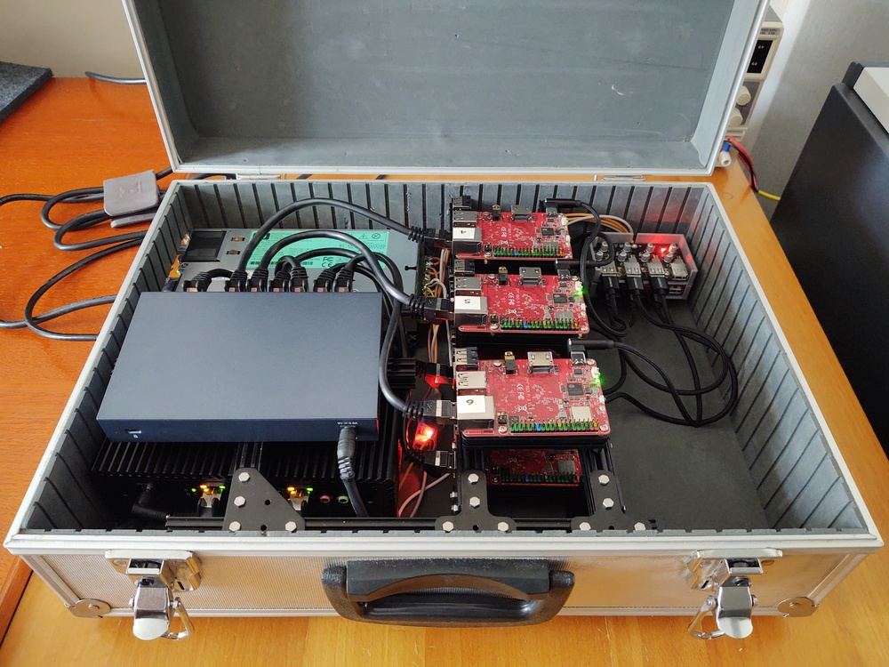

# minicluster

Documentation of a mini bare-metal cluster intended for Kubernetes experiments. It consists in 6 nodes (X86_64 architecture) managed by a server node providing global services (DNS, etc.). The whole cluster fits in a case and is therefore portable.

Day-to-day information on the cluster [is available on my blog](https://www.mouton.in/categories/minicluster/).

## Building

All information related to hardware is gathered in a [dedicated page](./hardware/README.md).

## OS deployment configuration

Initial plan was to deploy CentOS 8 stream using
* [The Foreman](https://theforeman.org) provisioning tool for nodes life cycle management
* Underlying configuration ([TFTP](https://docs.centos.org/en-US/8-docs/advanced-install/assembly_preparing-for-a-network-install/#configuring-a-tftp-server-for-bios-based-clients_preparing-for-a-network-install), etc.) to enable The Foreman to deploy OS by [kickstart](https://docs.centos.org/en-US/8-docs/advanced-install/assembly_creating-installation-sources-for-kickstart-installations/
) files through PXE boot.

As I discovered that [cluster nodes](./hardware/README.md) couldn't boot with PXE, deployment is not automated for now. Stay tuned on the blog for more information.

## Gateway configuration and global network services

A dedicated page [gathers information](./gateway_configuration.md) on gateway configuration.

## Global cluster configuration

As much as possible, and once public keys of management accounts have been deployed on nodes, global configuration is done using [Ansible scripts](./ansible/README.md)

## Kubernetes deployment

To be continued ...

