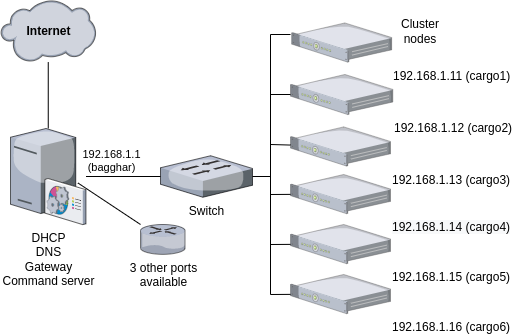

# Gateway and global network configuration

## Network and gatewy overview

## Gateway configuration

Configuration of `/etc/` directory is managed with `etckeeper` command and stored in a remote git repository on gitlab according to procedure described in: https://coderwall.com/p/v1agsg/installing-etckeeper-to-store-config-with-autopush-to-git-in-ubuntu-14-04-lts

### Manual configuration
In order to perform the first basic configuration tasks, a parallel shell is installed. The chosen tool is [pdsh](https://github.com/chaos/pdsh), also available as distribution package. Example of basic use: 

    pdsh -w ssh:user@nodename[1-XX] "uname -nrpo"

The gateway acts as an autonomous time server, to be able to work offline. Therefore [chrony](https://www.itzgeek.com/post/how-to-install-ntp-chrony-on-centos-8-centos-7-rhel-8-rhel-7/) is installed and setup with the following parameters:

    # Enable kernel synchronization of the real-time clock (RTC).
    rtcsync
    # Allow NTP client access from local network.
    allow 192.168.1.0/24
    # Serve time even if not synchronized to a time source.
    local stratum 10

The command below sets time *immediately* on nodes `cargo1` to `cargo6`:
    pdsh -w ssh:root@cargo[1-6] "chronyc -a burst 4/4" |sort

Other manual setups:
* deactivate SELINUX
* create user `capitaine` with sudo capability
* Create keys for root and capitaine and deploy public keys on nodes
* Install Ansible

## Network configuration

Installation of `bind-utils` package is recommended for network troubleshooting
The server is set as gateway. It means that the gateway must forward traffic by NAT using the following commands:

    echo "1" >/proc/sys/net/ipv4/ip_forward
    sysctl -w net.ipv4.ip_forward=1

The gateway must provide at least two key network services:
* DHCP, to manage cluster nodes 
* DNS, to have an autonomous cluster with nodes able to call each other by their names

Tools used are:
* For DHCP, classic dhcpd server, configured according to:
    * https://kifarunix.com/install-and-setup-dhcp-server-on-centos-8/
    * https://vitux.com/how-to-install-and-configure-dhcp-server-on-centos/
* For DNS, DNSmasq as cache of DNS server and to add local names
    * DNSmasq is configured to deliver only DNS, using `no-dhcp-interface` parameter
    * DNS service is only available on the ethernet device connected with cluster nodes 
    * A specific list of upstream DNS servers is defined in a file different from `resolv.conf`, using `resolv-file` parameter. 

Default route is set on the ethernet device connected *outside* of the cluster. 

* How to configure a CentOS 8 cluster: https://jjasghar.github.io/blog/2020/02/14/centos-8-as-my-new-router/
