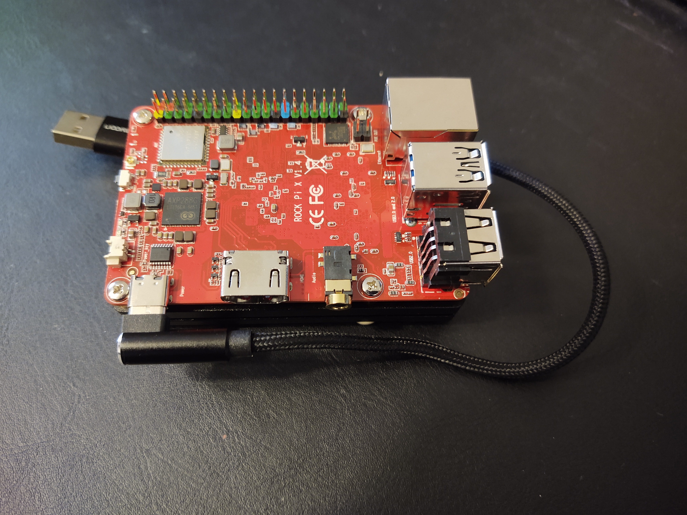

# Hardware specifications and build

## Requirements for the cluster

* A configuration and management server with at least two Ethernet ports: one for communication inside the cluster and one for Internet access. Additional ports may enable multi kubernetes scenarios by partitioning the cluster.
* Cheap cluster nodes to be able to go up to 6 items (enough to test orchestration or inter kubernetes communication with two three-nodes sub clusters).
* Cheap but powerful enough cluster nodes in order to run real applications. 4GB of RAM and 16GB of disk is a minimum
* Everything should be fanless to be able to pack the cluster in a small space

## Selected hardware and Bill of Material

* [Bill of Material](./BoM.md) of the 1k€ cluster

The configuration server is a cheap no-brand fanless mini PC with 4 Ethernet ports.

Cluster nodes are [Rock-PI X](https://wiki.radxa.com/RockpiX).

The rational is the following:
| Pros | Cons |
| ---- | ---- |
|eMMC storage: more reliable than microSD |New: no or small user base|
|Fanless|No Real Time Clock (RTC) by default|
|X86_64 architecture: more containers available |PXE BIOS deactivated|

Most cons have a workaround and a bet on the user base is acceptable.

Nodes are powered by a professional-grade used power through a USB charger. Network switch and server are also connected to the same power and the whole cluster is powered by a single source. 
A `temperusb` USB temperature probe has been added.
 
